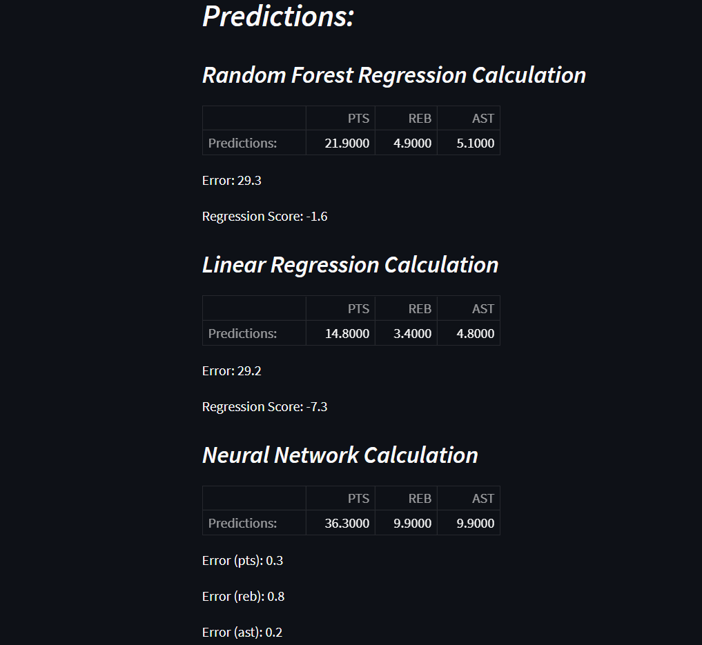

# nbaStats
Predicts basic NBA statlines (points, rebounds, assists) for a given player in the next upcoming game using different forms of ML. 

Test the current version at: https://share.streamlit.io/dsaunders11/nbastats/main/operate.py

## Sample Output 



## Notes 

There are still some bugs and general issues with the regression methods used; I am continuing to work on these. 

## Citations 

This package makes use of the balldontlie API (https://github.com/ynnadkrap/balldontlie or https://www.balldontlie.io/#introduction). 

ML algorithms are drawn from the scikit-learn library:

Scikit-learn: Machine Learning in Python, Pedregosa et al., JMLR 12, pp. 2825-2830, 2011.

Found at https://scikit-learn.org/stable/index.html. 

## Installation 

First install the necessary dependencies...

- numpy, pandas, requests, json, time, datetime, sklearn, streamlit

Clone the repository and install it using... 

```
pip install .
```

from within the home directory (nbaStats/)

## Use

To use the statline predictor without downloading the code, go to https://share.streamlit.io/dsaunders11/nbastats/main/operate.py

To follow a more involved process, you can import the code into a python file or notebook and follow the process given below...

```
import nbaStats as nb

player = 'Your Input'
pl = nb.Player(player)

training_data = nb.compiler(pl.stats)

pred_model, pred_inputs = nb.train_model(training_data)
pred_modelfr, pred_inputsfr = nb.training_forest(training_data)

next_game, gamedate, opp = nb.nextgame(pl, training_data) 

forest_prediction = nb.predict_forest(next_game, pl, gamedate, pred_modelfr, pred_inputsfr)
linear_prediction = nb.predict(next_game, pl, gamedate, pred_model, pred_inputs)
neuralnet_prediction = nb.predict_nn(training_data, next_game, pl, gamedate)

correlation = nb.corr(forest_prediction, linear_prediction, neuralnet_prediction)
```

### Breakdown of Use 

First you instantiate the player class object and compile the training data to be used for the regressions. The sklearn models (linear and random forest regressions) have to be trained, saving the predictions on the test data as well as the test data itself. Next, the sample for the next game has to be generated via API requests, and finally each prediction can be run on said sample. The final prediction results are returned, as well as the relevant errors. The last line computes a correlation between the three prediction methods.

## Methodology 

Regression problems like this one require the use of training and test data. My algorithm for picking out training data (as well as what numerical and categorical variables to trian on) is not comprehensive; this is the first version of this package meant to give rudimentary predictions. That being said, here is how I went about organizing the data...

I decided to only work with data from the current NBA season, which means that predictions will get better as the season progresses (given more games have occured). Each predicted statistic is considered to be influenced by the previous 5 game stats in points, rebounds, and assists, as well as by the opponent and whether the player is playing at home or away. This five game designation is entirely arbitrary, and making it more flexible is something I hope to implement in the future. Note that this also means that players with fewer than 5 games played will cause an error (though they probably aren't the best to predict on anyway). Also arbitrary (and flexible to adjust should the user wish) are the splits between which data is trained or tested on (20% is used for testing currently) and the number of iterations the neural network undergoes. 

The errors in the cases of the sklearn models are taken as mean squared errors, while for the neural network I take the most recent error in the training process as the error on the predicted values. Given that these errors are computed in different ways, I measure the *correlation* between the methods not based on error, but rather based on summing the differences between each statistic and the average computed value for said statistic. I then take an average of these differences as a correlation factor, which is simply a number the the user should aim to get as close to 0 as possible. This is a heuristic process and is meant to be used as a qualitative assessment. 
